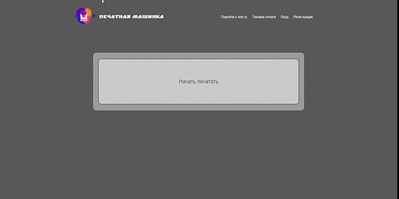

# Blind Typing ⌨️
---




## Live Demo 📺

https://blind-typing-project.onrender.com запуск может занять от 5 секунд до нескольких минут все зависит от Хостинга.

---

## JavaScript / HTML / CSS

Это мой первый проект я его написал в январе 2022 года тогда я еще не понимал как правильно работать с GitHub поэтому залил его только весной.

Date : 06-12-2022 16:37:10 <br/>
Total : 3 files,  1200 codes, 46 comments, 214 blanks, all 1450 lines

| language | files | code | comment | blank | total |
| :--- | ---: | ---: | ---: | ---: | ---: |
| HTML | 1 | 552 | 9 | 66 | 627 |
| CSS | 1 | 411 | 11 | 100 | 522 |
| JavaScript | 2 | 232 | 26 | 47 | 305 |

---

## Адаптивный дизайн

Нету

---

## Установка

```
1. npm install
```


## Скрипты

```
1. npm start
2. Нужно открыть в браузере http://localhost/
```
